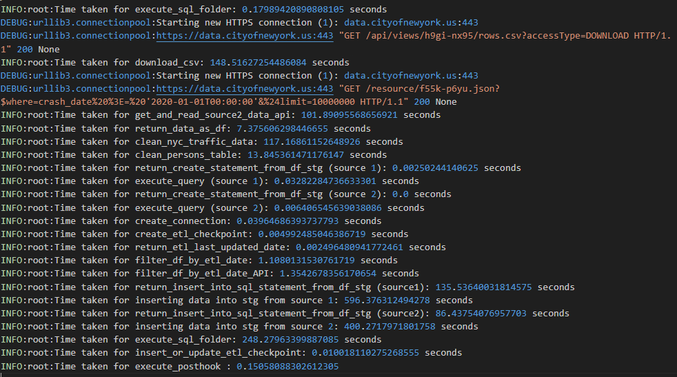
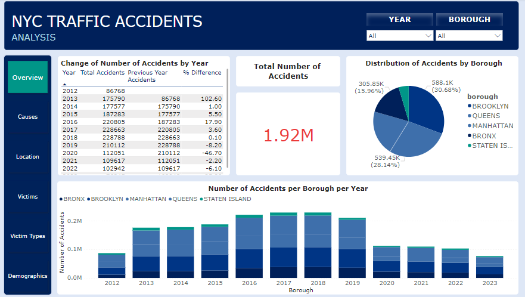
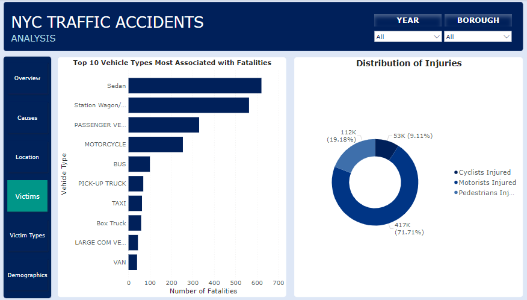
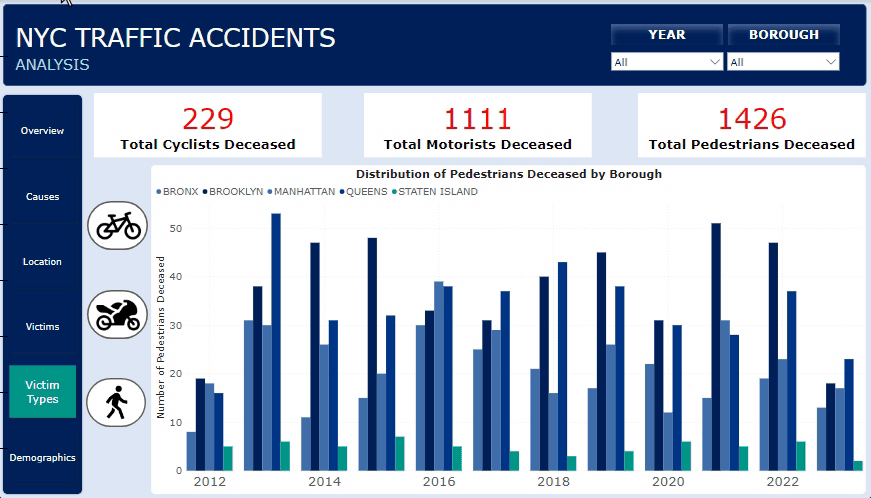
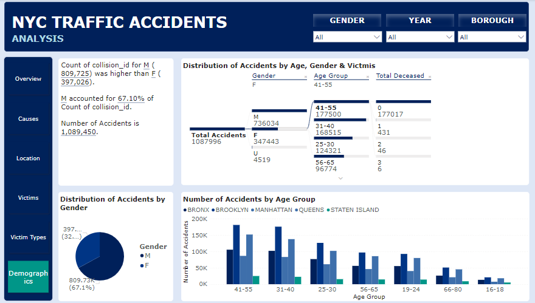

<div>

> Hello world! This is the project’s summary that describes the project, plain and simple, limited to the space available.
**[PROJECT PHILOSOPHY](#project-philosophy) • [PROTOTYPING](#prototyping) • [TECH STACKS](#stacks) • [IMPLEMENTATION](#demo) • [HOW TO RUN?](#run)**

</div> 
  

<br><br>

<!-- project philosophy -->

<a  name="philosophy" ></a>


> A python based ETL project that would extract, transform data from different web sources and load them into a tabular database (PostgreSQL) in an attempt to provide a full scope analytical understanding of the NYC traffic accidents. 

>NYC Traffic Accidents Analysis Project aims to analyze historical and current data to gain insights into accident patterns and trends, providing valuable information for improving road safety and traffic management.
<br>

  

### User Types

 

1. Data Engineers.
2. Data Analysts.
3. Traffic Engineers.
4. Public Safety Advocates.
5. Governmental Organizations.
  

<br>

  

### User Stories

  
1. As a Data Engineer:<br>
	I want to ensure that NYC traffic accidents data is collected, stored, and processed efficiently.<br>
	I want to automate data retrieval from various sources for real-time analysis<br>
	I want to build and maintain robust data pipelines to ensure data accuracy.

2. As an Analyst:<br>
	I want to explore and analyze NYC traffic accidents data to identity patterns and trends.<br>
	I want to query the database.<br>
	I want to access interactive dashboards for data visualization.

3. As a Traffic Engineer:<br>
	I want to have access to detailed traffic accident data for traffic management and safety improvements.<br>
	I want to analyze traffic accident hotspots and identify areas that require infrastructure changes.<br>
	I want to monitor the impact of traffic interventions through historical data.

4. As a Public Safety Advocate:<br>
	I want to use traffic accident data to raise public awareness about safety issues.<br>
	I want to identify areas with high accident rates and advocate for safety improvements.<br>I want to collaborate with local authorities to address safety concerns.

5. As a Governmental Organization:<br>
   I want to have access to comprehensive traffic accident data to inform policy decision makers and resource allocation.<br>
	I want to assess the effectiveness of traffic safety measures over time.<br>
	I want to have access to real-time data for emergency response coordination and traffic management.


<br><br>

<!-- Prototyping -->


> We have designed our project to obtain data through an ETL process, and we've included it in a PowerBI Sample Dashboard,
  

### Logger File

  
  

> First ETL run takes ~25 mins and then each run takes ~10 mins


### Data Flow Diagrams

  

 
  
  

<br><br>

  

<!-- Tech stacks -->

<a  name="stacks"></a>


<br>

  

Bin Tracker is built using the following technologies:

  

## Frontend

Interactive PowerBI Dashboard:

A main interface for viewers to explore:

1. Traffic Accident Trends: Graphs, charts, and visualizations showcasing key traffic accident metrics over time.
2. Location Analysis : Visual representations of NYC Map including accident locations by borough, street, and geographical coordinates, with interactive map.
3. Demographic Insights: Data visualizations highlighting trends in the age, gender, and role of individuals involved in accidents.
4. Victim Summary: Summary data on total victims, injuries, and fatalities, providing insights into the impact of accidents.
5. Custom Filters: Options for customizing views by date, location, or specific accident characteristics


  

<br>

  

## Backend

1. Data Retrieval & API Integration: Utilizing the Socrata API to retrieve traffic accident data from authoritative sources.
2. ETL Pipeline: using Python and Pandas, raw data is extracted, transformed into a usable format and loaded into PostgreSQL database.
3. Database: Schema Design - Indexing - Data Integrity - Backup & Recovery. 

<br>

<br>
<h3> Overview Page </h3>
<br>

    
<br>
<h3> Causes Page </h3>
<br>

  
<br>
<h3> Location Page </h3>
<br>

    
<br>
<h3> Victims Page </h3>
<br>

 
<br>
<h3> Victim Types Page </h3>
<br>

    
<br>
<h3> Demographics Page </h3>
<br>

 
  
<br><br>

## Report Demo


<br><br>

<!-- Implementation -->

<a  name="Demo"  ></a>


> Show command line of ETL performance - Logger view

  
### App

## Tech Stacks

### Frontend

- **Business Intelligence Tool:** Power BI

### Backend

- **Programming Language:** Python
  - **Libraries:** PyScobg2, Requests, DateTime, Pandas, NumPy, OS
- **Database:** PostgreSQL
- **Deployment and Hosting:** AWS
- **Version Control:** GitHub (SourceTree for Git client)

### Data Integration

- **API Integration:** SOCRATA API


<br><br>


<br><br>


<!-- How to run -->

<a  name="run"  ></a>

  

> To set up **NYC Traffic Accidents Analysis** follow these steps:

### Prerequisites


**Hardware & Software**:

-   A computer/server with sufficient RAM and processing power.
-   Operating system: Linux (preferred for production) or Windows.
-   Required software: Python (3.x), PostgreSQL, Git (for version control), and any other specific software packages.
  
  

**Dependencies**:

-   Install the necessary Python libraries: `pandas`, `numpy`, `pyscobg2`, `os`, `requests`.
-   Install database connectors/drivers for PostgreSQL.
  

### **Setting Up the Environment**:

**Clone the Repository**:


```sh

git clone https://github.com/MahmoudElSayed100/SEF-Final-Project-NYC-Accidents-Analysis.git

```

  
**Set Up the Database**:

-   Start the PostgreSQL server.
-   Create a new database and user with the appropriate permissions.
-   Run any initialization scripts to set up tables or initial.

### **Running the Backend**:

**Start the Data Ingestion & ETL Process**:
`main.py`


You should be able to check the app.log file to see the ETL work.

As for the dashboard access: Please use this link "public powerbi link" to access your data.
